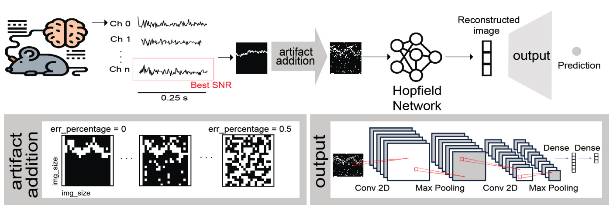

# Hopfield-Enhanced Deep Neural Networks for Artifact-Resilient Brain State Decoding

## Overview

HDNN-ArtifactBrainState is a cutting-edge project that integrates Hopfield networks with deep neural networks to enhance brain state decoding, focusing on resilience against artifacts. This repository houses the code and resources for implementing the HDNN framework described in our recent publication.


ArXiv preprint: 
[ArXiv Paper](https://arxiv.org/abs/2311.03421)


## Citation

If you found it useful, please consider cite our work as follows:

Bibtex: 
```bash
@misc{marinllobet2023hopfieldenhanced,
      title={Hopfield-Enhanced Deep Neural Networks for Artifact-Resilient Brain State Decoding}, 
      author={Arnau Marin-Llobet and Arnau Manasanch and Maria V. Sanchez-Vives},
      year={2023},
      eprint={2311.03421},
      archivePrefix={arXiv},
      primaryClass={q-bio.NC}
}

```

Marin-Llobet, A., Manasanch, A., Sanchez-Vives, MV. "Hopfield-Enhanced Deep Neural Networks for Artifact-Resilient Brain State Decoding". Presented at NeurIPS 2023, AMHN Workshop.

## Getting Started

### Prerequisites

Ensure you have Conda installed on your system for managing packages and environments.

### Installation

To set up your environment for HDNN-ArtifactBrainState, run the following commands:

```bash
$ conda create --name HDNN python=3.9
$ conda activate HDNN
$ conda install tensorflow=2.13.0 numpy=1.24.3 matplotlib=3.5.2 sklearn=1.1.1 seaborn=0.12.2
$ conda install -c conda-forge jupyterlab
```
(sklearn and tensorflow can be installed via: ```pip install scikit-learn==1.1.1``` and ```pip install tensorflow==1.24.3``` if conda channels can't install these dependencies)


### Usage
Clone the repository:

```bash
$ git clone https://github.com/arnaumarin/HDNN-ArtifactBrainState.git
$ cd HDNN-ArtifactBrainState
$ conda activate HDNN
$ jupyter lab
```
Open and run the Demo_Hopfield_CNN.ipynb notebook in JupyterLab to explore the functionalities of the HDNN framework.

## Contact
For any queries or contributions, please open an issue or submit a pull request in this repository.
